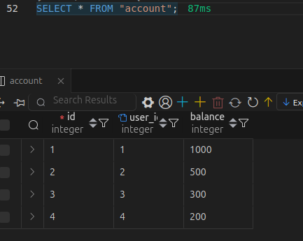
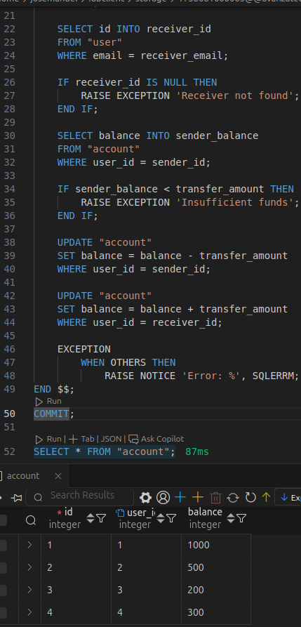
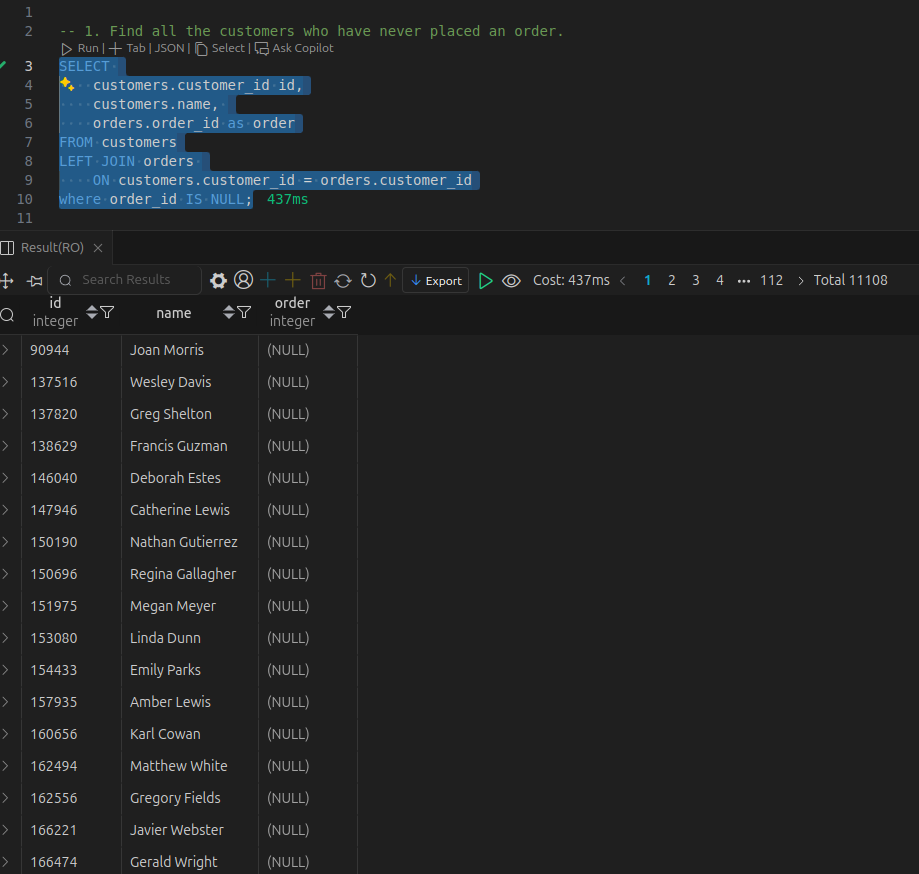
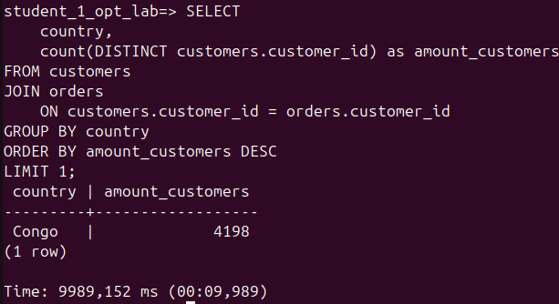
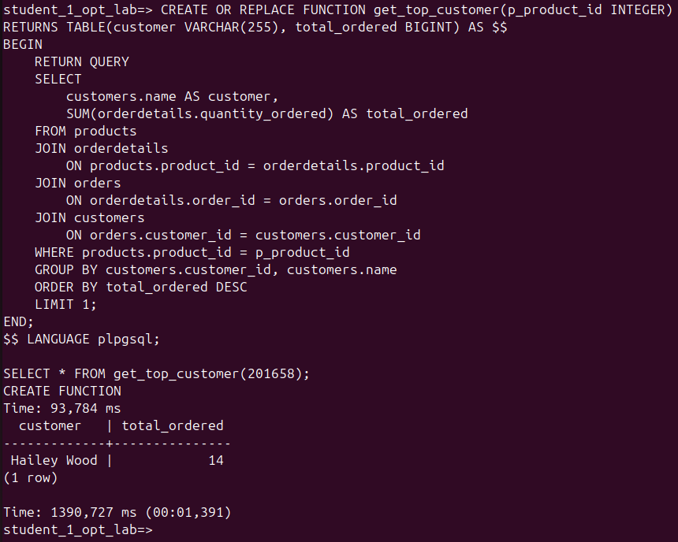
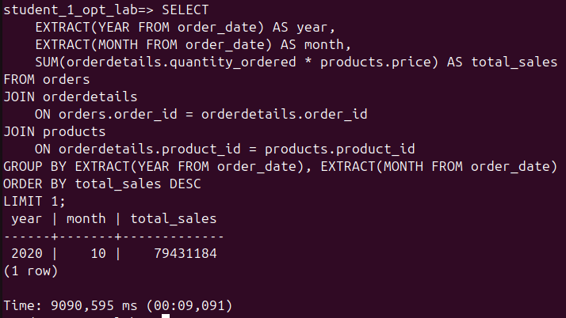
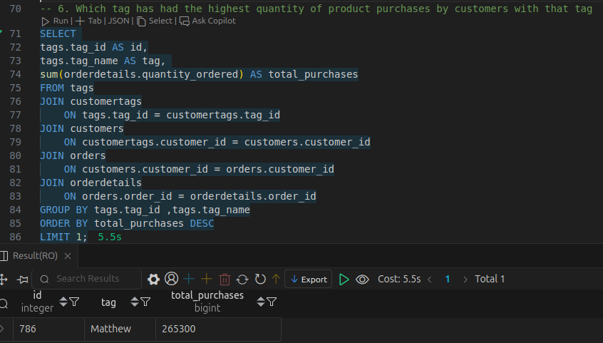
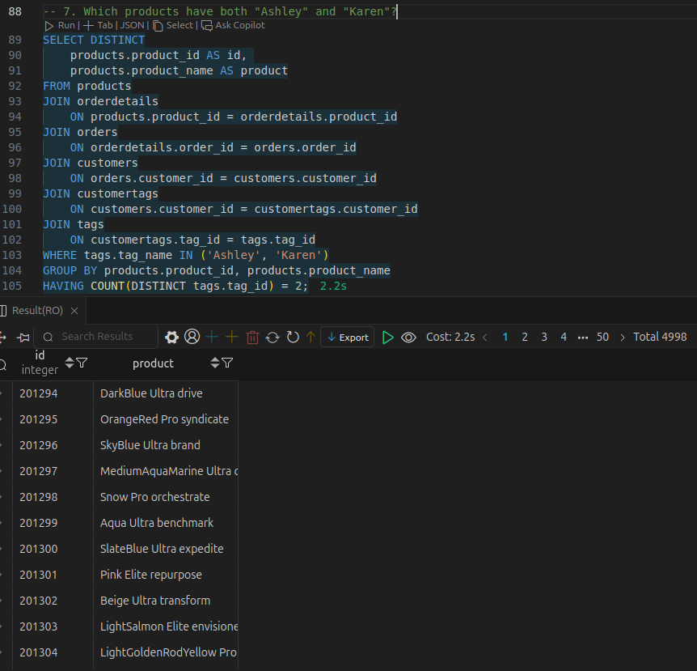

# SQL Lab Exercises

## Lab 1: Transaction Lab

#### This code first starts a transaction, then declares the necessary variables for the transaction. After that, it makes verifications about transaction consistency with exceptions, and finally updates and commits.

#### code:
```sql
DO $$
DECLARE
    sender_email VARCHAR := 'bill.johnson@fmail.com';
    receiver_email VARCHAR := 'craig.williams@hmail.com';
    transfer_amount INTEGER := 100;

    sender_id INTEGER;
    receiver_id INTEGER;
    sender_balance INTEGER;

BEGIN

    SELECT id INTO sender_id
    FROM "user"
    WHERE email = sender_email;

    IF sender_id IS NULL THEN
        RAISE EXCEPTION 'Sender not found';
    END IF;

    SELECT id INTO receiver_id
    FROM "user"
    WHERE email = receiver_email;

    IF receiver_id IS NULL THEN
        RAISE EXCEPTION 'Receiver not found';
    END IF;

    SELECT balance INTO sender_balance
    FROM "account"
    WHERE user_id = sender_id
    FOR UPDATE;

    IF sender_balance < transfer_amount THEN
        RAISE EXCEPTION 'Insufficient funds';
    END IF;

    UPDATE "account"
    SET balance = 
        CASE 
            WHEN user_id = sender_id THEN balance - transfer_amount
            WHEN user_id = receiver_id THEN balance + transfer_amount
        END
    WHERE user_id IN (sender_id, receiver_id);

    EXCEPTION
        WHEN OTHERS THEN
            ROLLBACK;
            RAISE NOTICE 'Error: %', SQLERRM;
    COMMIT;
END $$;
```

#### Before



#### after



## Lab 2: Optimization Lab

### 1. Find all the customers who have never placed an order.

#### Select customers who have no orders (not order whit that customer_id)

```sql
SELECT 
    customers.customer_id id,
    customers.name, 
    orders.order_id as order
FROM customers
LEFT JOIN orders 
    ON customers.customer_id = orders.customer_id
where order_id IS NULL;
```




### 2. Which country has the highest number of customers?

#### Uses a count(*) to determine the number of customers for each country by grouping them

```sql
SELECT
    country,
    count(DISTINCT customers.customer_id) as amount_customers
FROM customers
JOIN orders
    ON customers.customer_id = orders.customer_id
GROUP BY country
ORDER BY amount_customers DESC
LIMIT 1;
```



### 3. List products that have been ordered more than 6500 times in total but haven't been ordered since 2023-09-10

#### Join products, orderdetails, and orders; then, group them by products and filter by order date and quantity ordered

```sql
SELECT 
    products.product_name AS product
FROM 
    products
JOIN orderdetails 
    ON products.product_id = orderdetails.product_id
JOIN orders 
    ON orderdetails.order_id = orders.order_id
GROUP BY 
    products.product_id
HAVING 
    SUM(orderdetails.quantity_ordered) > 6500
    AND MAX(orders.order_date) <= '2023-09-10' ;
```


### 4. For a given product, identify customers who have ordered that product the most.

#### Creates a function that joins: products, orderdetails, orders, and customers, after that select a given product, group by product and customer, and get the top 10 rank

```sql
CREATE OR REPLACE FUNCTION get_top_customer(p_product_id INTEGER)
RETURNS TABLE(customer VARCHAR(255), total_ordered BIGINT) AS $$
BEGIN
    RETURN QUERY
    SELECT 
        customers.name AS customer,
        SUM(orderdetails.quantity_ordered) AS total_ordered
    FROM products
    JOIN orderdetails
        ON products.product_id = orderdetails.product_id
    JOIN orders
        ON orderdetails.order_id = orders.order_id
    JOIN customers
        ON orders.customer_id = customers.customer_id
    WHERE products.product_id = p_product_id
    GROUP BY customers.customer_id, customers.name
    ORDER BY total_ordered DESC
    LIMIT 1;
END;
$$ LANGUAGE plpgsql;

SELECT * FROM get_top_customer(201658);
```



### 5. Find the month with the highest sales.

#### Join products, orderdetails, and orders; then, group them by month and calculate the total sales for each month. Finally, order the results by total sales in descending order and limit the result to the top 1.

```sql
SELECT 
    EXTRACT(YEAR FROM order_date) AS year,
    EXTRACT(MONTH FROM order_date) AS month,
    SUM(orderdetails.quantity_ordered * products.price) AS total_sales
FROM orders
JOIN orderdetails 
    ON orders.order_id = orderdetails.order_id
JOIN products 
    ON orderdetails.product_id = products.product_id
GROUP BY EXTRACT(YEAR FROM order_date), EXTRACT(MONTH FROM order_date)
ORDER BY total_sales DESC
LIMIT 1;
```



### 6. Which tag has had the highest quantity of product purchases by customers with that tag

#### Join tags, customertags, customers, orders, and orderdetails; then, group them by tag and calculate the total quantity of product purchases for each tag. Finally, order the results by total purchases in descending order and limit the result to the top 1.

```sql
SELECT 
    tags.tag_id AS id,
    tags.tag_name AS tag, 
    sum(orderdetails.quantity_ordered) AS total_purchases
FROM tags
JOIN customertags
    ON tags.tag_id = customertags.tag_id
JOIN customers
    ON customertags.customer_id = customers.customer_id
JOIN orders
    ON customers.customer_id = orders.customer_id
JOIN orderdetails
    ON orders.order_id = orderdetails.order_id
GROUP BY tags.tag_id, tags.tag_name
ORDER BY total_purchases DESC
LIMIT 1;
```



### 7. Which products have both "Ashley" and "Karen"?

#### Join products, orderdetails, orders, customers, customertags, and tags; then, filter by tags "Ashley" and "Karen". Group by product and ensure both tags are present.

```sql
SELECT DISTINCT
    products.product_id AS id, 
    products.product_name AS product
FROM products
JOIN orderdetails
    ON products.product_id = orderdetails.product_id
JOIN orders
    ON orderdetails.order_id = orders.order_id
JOIN customers
    ON orders.customer_id = customers.customer_id
JOIN customertags
    ON customers.customer_id = customertags.customer_id
JOIN tags
    ON customertags.tag_id = tags.tag_id
WHERE tags.tag_name IN ('Ashley', 'Karen')
GROUP BY products.product_id, products.product_name
HAVING COUNT(DISTINCT tags.tag_id) = 2;
```



### 8. Find products that have been purchased at least once by a customer with the “Ashley” tag (must complete in under 500ms)

#### Create indexes to optimize the query and ensure it completes in under 500ms. Then, join products, orderdetails, orders, customers, customertags, and tags; filter by the "Ashley" tag

```sql
CREATE INDEX IF NOT EXISTS idx_orders_customer_id ON orders(customer_id);
CREATE INDEX IF NOT EXISTS idx_orderdetails_order_id ON orderdetails(order_id);

EXPLAIN ANALYZE
SELECT
    products.product_name AS product
FROM products
JOIN orderdetails
    ON products.product_id = orderdetails.product_id
JOIN orders
    ON orderdetails.order_id = orders.order_id
JOIN customers
    ON orders.customer_id = customers.customer_id
JOIN customertags
    ON customers.customer_id = customertags.customer_id
JOIN tags
    ON customertags.tag_id = tags.tag_id
WHERE tags.tag_name = 'Ashley'
GROUP BY products.product_name;
```


